# WorkTimeTracker

## Projektbeschreibung

Der WorkTimeTracker ist eine Webapplikation zur Verwaltung von Arbeitszeiten.

Benutzer können Projekten zugeordnet werden und Arbeitszeiten erfassen. Die Anwendung ermöglicht die Verwaltung von Projekten, Benutzern, Zeiteinträgen und Reports.

Das Frontend wurde mit Angular entwickelt und kommuniziert über REST-Schnittstellen mit dem Spring-Boot-Backend.

Die Authentifizierung und Autorisierung erfolgt über Keycloak und OAuth2.

---

## Verwendete Technologien

### Frontend

- Angular
- TypeScript
- HTML
- SCSS
- RxJS

### Backend

- Spring Boot
- Spring Security
- OAuth2 Resource Server
- JPA / Hibernate

### Datenbank

- PostgreSQL

### Authentifizierung

- Keycloak
- JWT

### Entwicklungswerkzeuge

- Visual Studio Code
- IntelliJ IDEA
- Git
- GitHub
- Postman

---

## Systemarchitektur

Frontend (Angular)
→
REST API
→
Backend (Spring Boot)
→
PostgreSQL

Authentifizierung:
Frontend → Keycloak → JWT Token → Backend

---

## Benutzerrollen

### ROLE_read

Darf Daten lesen.

- Projekte anzeigen
- Benutzer anzeigen
- Zeiteinträge anzeigen
- Reports anzeigen

### ROLE_update

Darf Daten lesen und bearbeiten.

- Projekte erstellen
- Projekte bearbeiten
- Projekte löschen
- Benutzer erstellen
- Benutzer bearbeiten
- Benutzer löschen
- Zeiteinträge erstellen
- Zeiteinträge bearbeiten
- Zeiteinträge löschen

### ROLE_admin

Vollzugriff auf alle Funktionen.

---

## Installation und Start

### Backend starten

```bash
cd backend
.\mvnw spring-boot:run
```

Backend läuft auf:

```text
http://localhost:9090
```

### Frontend starten

```bash
cd frontend
npm install
npx ng serve
```

Frontend läuft auf:

```text
http://localhost:4200
```

### Keycloak starten

Keycloak muss lokal auf Port `8080` laufen.

Danach muss der Realm importiert werden:

```text
keycloak/realm-export.json
```

Der Realm heisst:

```text
WorkTimeApp
```

---

## Komponentenübersicht

### Pages

- DashboardComponent
- ProjectListComponent
- ProjectDetailComponent
- TimeEntryListComponent
- TimeEntryDetailComponent
- UserListComponent
- UserDetailComponent
- ReportListComponent
- NoAccessComponent

### Weitere Komponenten

- AppHeaderComponent
- AppLoginComponent
- ConfirmDialogComponent

### Services

- ProjectService
- UserService
- TimeEntryService
- ReportService
- AppAuthService
- HeaderService
- KeycloakService

---

## Funktionen

### Login

Die Anmeldung erfolgt über Keycloak.

Nach erfolgreichem Login wird ein JWT Token erzeugt und für alle REST-Anfragen verwendet.

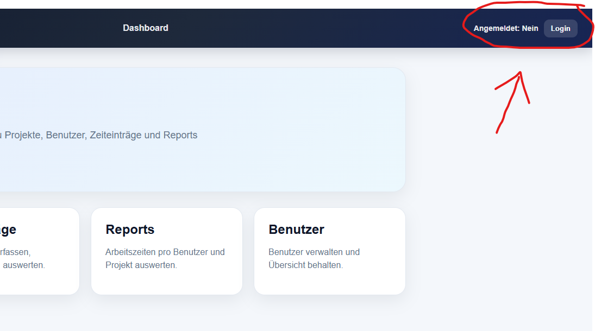
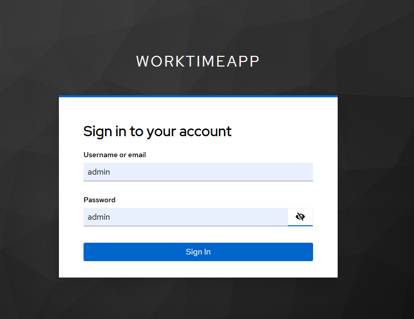
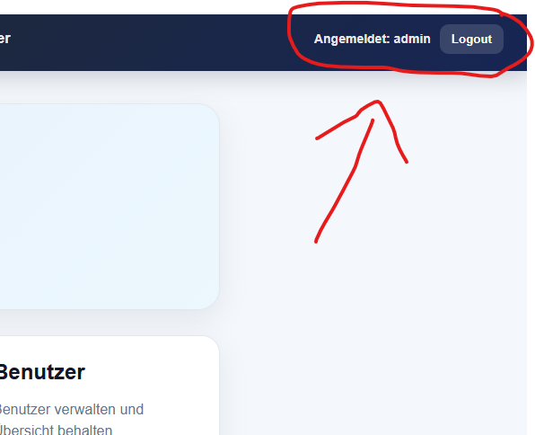

---

### Dashboard

Das Dashboard dient als zentraler Einstiegspunkt.

Von hier aus können alle Verwaltungsbereiche geöffnet werden.

#### Dashboard Ansicht
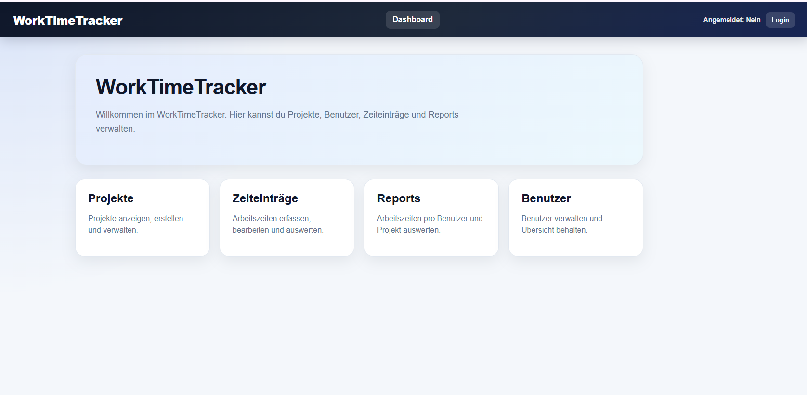

---

### Projekte

Funktionen:

- Projekte anzeigen
- Projekte erstellen
- Projekte bearbeiten
- Projekte löschen

#### Projektübersicht
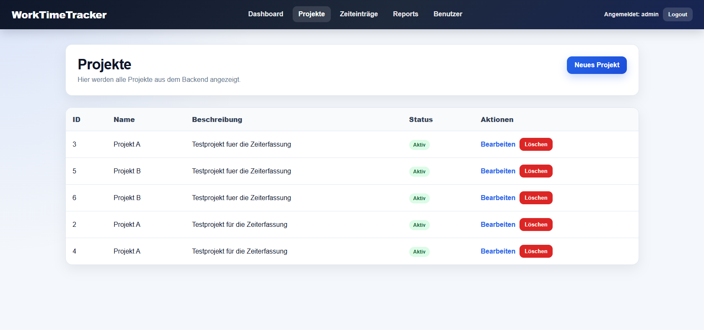

#### Projekt bearbeiten
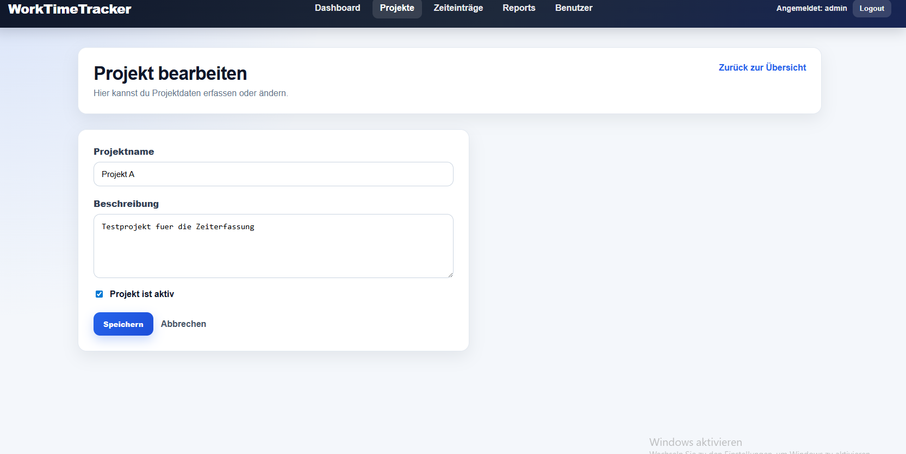
---

### Zeiteinträge

Funktionen:

- Zeiteinträge anzeigen
- Neue Zeiteinträge erfassen
- Zeiteinträge bearbeiten
- Zeiteinträge löschen

#### Zeitneinträge Übersicht
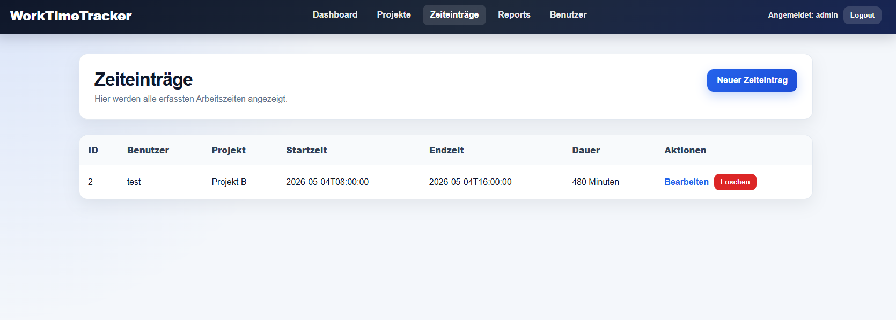

#### Zeiteinträge bearbeiten
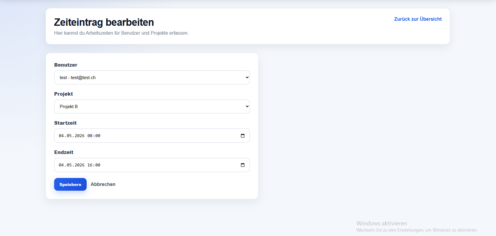

---

### Benutzer

Funktionen:

- Benutzer anzeigen
- Benutzer erstellen
- Benutzer bearbeiten
- Benutzer löschen

Hinweis:
Die Login-Benutzer werden über Keycloak verwaltet.
Die hier erfassten Benutzer dienen der fachlichen Zuordnung von Zeiteinträgen.

#### Benutzer Übersicht
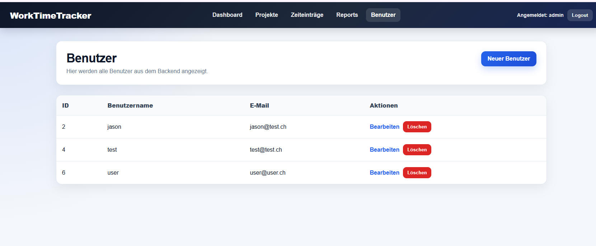

#### Benutzer bearbeiten
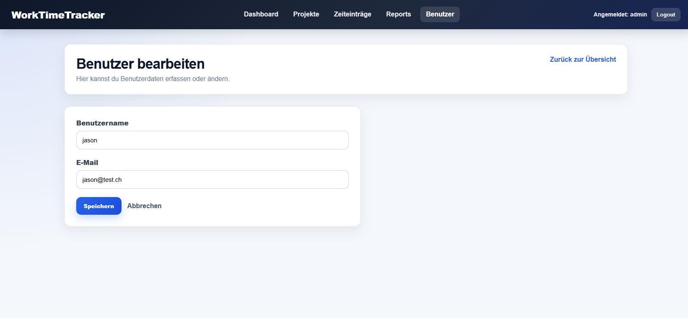

---

### Reports

Funktionen:

- Auswertung von Arbeitszeiten
- Übersicht nach Benutzern
- Übersicht nach Projekten

#### Report Übersicht
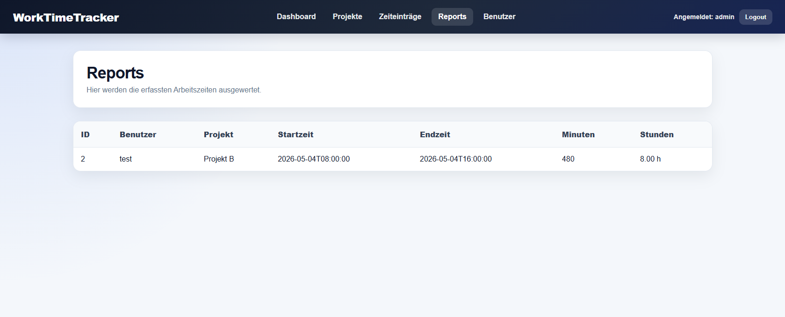

---

## Unit Tests

Für die wichtigsten Komponenten und Services wurden Unit Tests implementiert.

Getestet wurden unter anderem:

- Komponenten
- Services
- Routing
- Datenzugriffe
- Authentifizierungsfunktionen

Testergebnis:

```text
43 Tests erfolgreich
0 Fehler
```
#### Unit Tests
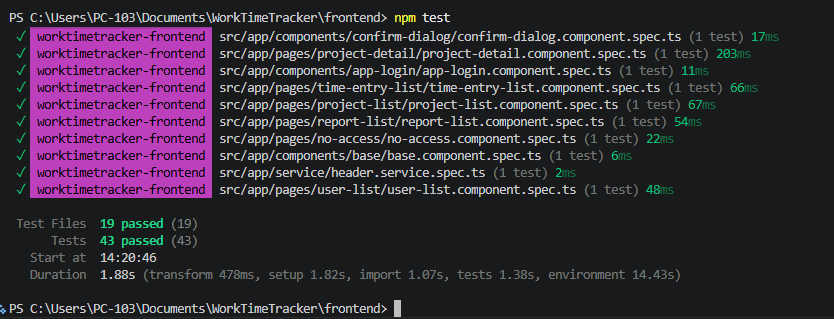

---

## GitHub

Das Projekt wird mit Git versioniert.

Alle Änderungen werden nachvollziehbar über Commits dokumentiert.

---

## Autor

Jason Zeitz

Modul 294
Frontend einer interaktiven Webapplikation realisieren